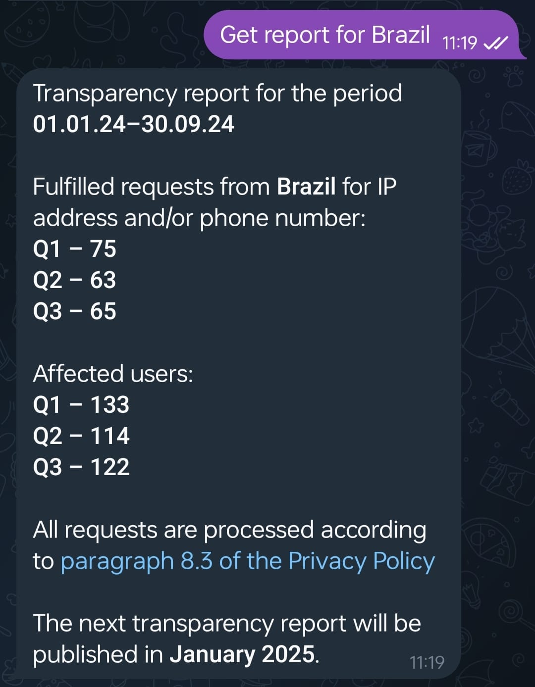

# telegram-transparency

Em outubro de 2024, o Telegram [iniciou um bot de transparência](https://www.404media.co/telegram-confirms-it-gave-u-s-user-data-to-the-cops/)(original em inglês) fornecendo dados sobre as solicitações feitas por governos ao Telegram: [@transparency](https://t.me/transparency).

Este bot fornece apenas dados para o país em que a conta do Telegram que solicita dados está registrada. Por exemplo, no Brasil:

Este [conjunto de dados](dataset.json) contém dados de transparência do Telegram para 2024 em 53 países até agora com base na contribuição de pessoas de todo o mundo, agradecimentos especiais à incrível comunidade no Mastodon!

## Contribuindo

Por favor, abra uma ocorrência (issue) com a captura de tela da resposta do bot do Telegram.

## Licença

Esses dados são fornecidos sob a licença [CC-BY](https://creativecommons.org/licenses/by/4.0/deed.en).
