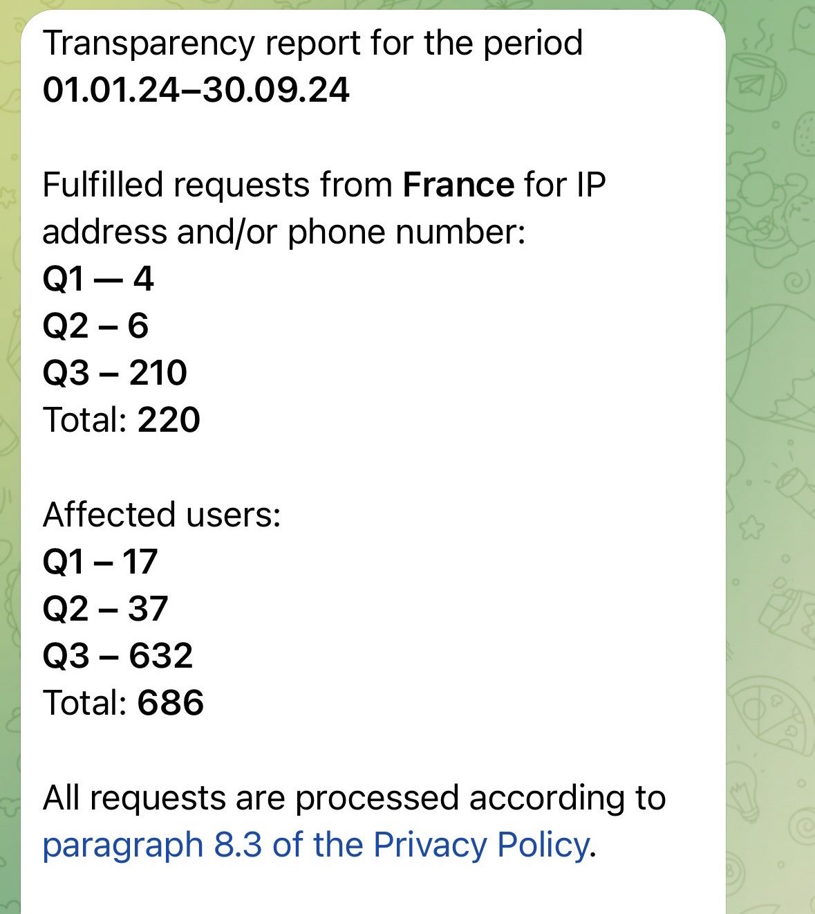

# telegram-transparency

In October 2024, Telegram [has started a transparency bot](https://www.404media.co/telegram-confirms-it-gave-u-s-user-data-to-the-cops/) providing data on requests done by governments: [@transparency](https://t.me/transparency).

This bot only provides data for the country in which the Telegram account demanding data is registered. For instance in France:

This [dataset](dataset.json) has been built by collecting this data from users in multiple countries in order to have a more precise view of legal requests toward Telegram.

## Contributing

Please open an issue with the screenshot of the Telegram's bot answer.

## License

This data is provided under [CC-BY](https://creativecommons.org/licenses/by/4.0/deed.en) license.

