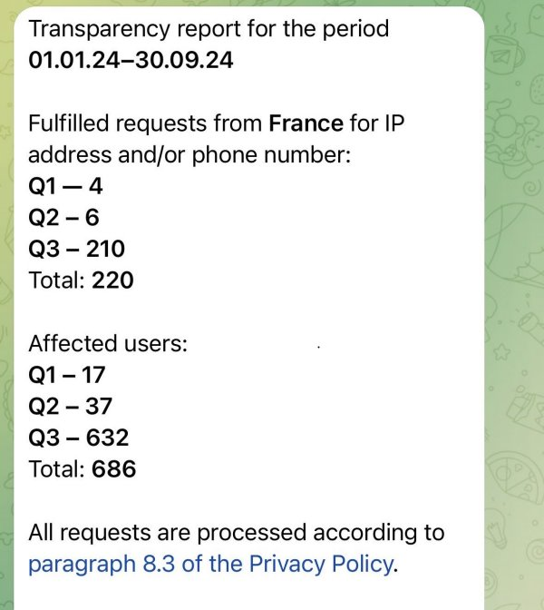

# telegram-transparency

In September 2024, Telegram [has changed its policy](https://www.bbc.com/news/articles/cvglp0xny3eo) to start accepting more requests from authorities. It turns out that Telegram has had a [@transparency](https://t.me/transparency) bot since [2018](https://meduza.io/en/news/2018/08/28/telegram-founder-assures-users-that-his-instant-messenger-s-new-privacy-policy-doesn-t-mean-he-s-getting-in-bed-with-the-fsb) but this bot only provides data for the country in which the Telegram account demanding data is registered. For instance in France:

Considering the recent change in Telegram policy, it is a timely moment to start consolidating this data to have an overview of how many requests Telegram accept from authorities and where.

This [dataset](dataset.json) contains Telegram transparency data for 2024 on **71 countries** so far based on contribution from people all around the world (special thanks to the amazing Mastodon community!). Each entry is the [Alpha-3 country code](https://www.iban.com/country-codes) of a country and contains number of requests by the authorities and number of users affected for specific period of time (most of the time January 1st to September 30th 2024 for now).

## Acknowledements

* The awesome Mastodon community
* The [Meduza](https://meduza.io/) data [and community](https://x.com/zd_vladislav/status/1842181592778690728)
* The Telegram channel [All Transparency Reports](https://t.me/TransparencyReport2024)

## Contributing

Please [open an issue](https://github.com/Te-k/telegram-transparency/issues) with the screenshot of the Telegram's bot answer, or send me an email at _tek AT randhome.io_.

## License

This data is provided under [CC-BY](https://creativecommons.org/licenses/by/4.0/deed.en) license.
